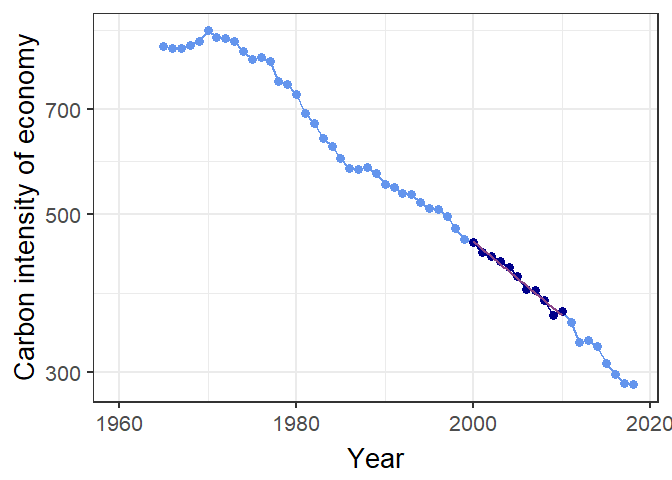
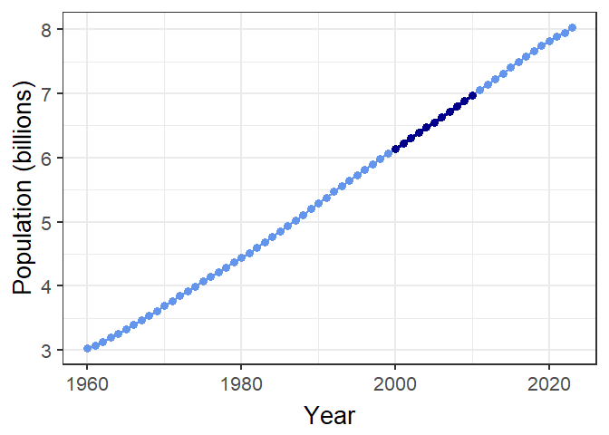
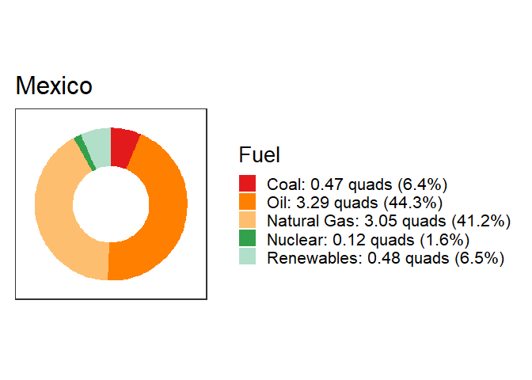

kayadata
================
Jonathan Gilligan
2022-04-14

# kayadata

<!-- badges: start -->

[](https://cran.r-project.org/package=kayadata)
[](https://doi.org/10.5281/zenodo.6462452)
[](https://opensource.org/licenses/MIT)
[](https://github.com/jonathan-g/kayadata/actions)
<!-- badges: end -->

This package loads Kaya-identity data, synthesized from several sources.

To install the package from CRAN:

``` r
install.packages("kayadata")
```

Once you’ve installed it, then you just need to use the command
`library(kayadata)` to load the package.

Some of the functions the package provides are:

-   `kaya_region_list()`: Get a list of available countries and regions.
-   `get_kaya_data()`: Get data for a specific country. Example:

``` r
mexico_data = get_kaya_data("Mexico") 
mexico_data %>% filter(year >= 1965) %>% 
  select(region:ef) %>%
  head()
#> # A tibble: 6 x 10
#>   region  year     P     G     E     F     g     e     f    ef
#>   <ord>  <int> <dbl> <dbl> <dbl> <dbl> <dbl> <dbl> <dbl> <dbl>
#> 1 Mexico  2020 0.129  1.20  6.14  373.  9.32  5.11  60.8  311.
#> 2 Mexico  2019 0.128  1.31  7.16  460. 10.3   5.47  64.2  351.
#> 3 Mexico  2018 0.126  1.31  7.43  477. 10.4   5.67  64.2  364.
#> 4 Mexico  2017 0.125  1.28  7.49  486. 10.3   5.84  64.9  379.
#> 5 Mexico  2016 0.123  1.26  7.38  480. 10.2   5.88  65.1  383.
#> 6 Mexico  2015 0.122  1.22  7.29  475. 10.0   5.96  65.2  388.
```

-   `project_top_down()`: Project future population, GDP, energy use,
    and emissions. Example:

``` r
mexico_2050 = project_top_down("Mexico", 2050)
mexico_2050
#> # A tibble: 1 x 10
#>   region  year     P     G     g     E     F     e     f    ef
#>   <chr>  <dbl> <dbl> <dbl> <dbl> <dbl> <dbl> <dbl> <dbl> <dbl>
#> 1 Mexico  2050 0.157  2.57  16.3  10.1  589.  3.93  58.2  229.
```

-   `plot_kaya`: Plot trends in Kaya variables for a given region or
    country. Example:

``` r
us_kaya = get_kaya_data("United States")
plot_kaya(us_kaya, "ef", y_lab = "Carbon intensity of economy",
          start_year = 2000, stop_year = 2010, log_scale = TRUE,
          trend_line = TRUE)
```



``` r
world_kaya = get_kaya_data("World")
plot_kaya(world_kaya, "P", start_year = 2000, stop_year = 2010, log_scale = FALSE,
          trend_line = FALSE)
```

 \*
`get_fuel_mix`: Get the fuel mix (coal, gas, oil, nuclear, and
renewables) for a region or country. Example:

``` r
mexico_mix = get_fuel_mix("Mexico")
mexico_mix
#> # A tibble: 5 x 5
#> # Groups:   region, year [1]
#>   region  year fuel         quads   frac
#>   <chr>  <int> <ord>        <dbl>  <dbl>
#> 1 Mexico  2020 Coal        0.198  0.0323
#> 2 Mexico  2020 Oil         2.34   0.381 
#> 3 Mexico  2020 Natural Gas 2.94   0.480 
#> 4 Mexico  2020 Nuclear     0.0961 0.0157
#> 5 Mexico  2020 Renewables  0.563  0.0918
```

-   `plot_fuel_mix`: Plot the fuel mix in a donut chart

``` r
plot_fuel_mix(mexico_mix)
```



After you install the package, you can get more help inside RStudio by
typing `help(package="kayadata")` in the R console window.

## Code of conduct

Please note that this project is released with a [Contributor Code of
Conduct](https://jonathan-g.github.io/kayadata/CODE_OF_CONDUCT.html). By
participating in this project you agree to abide by its terms.
